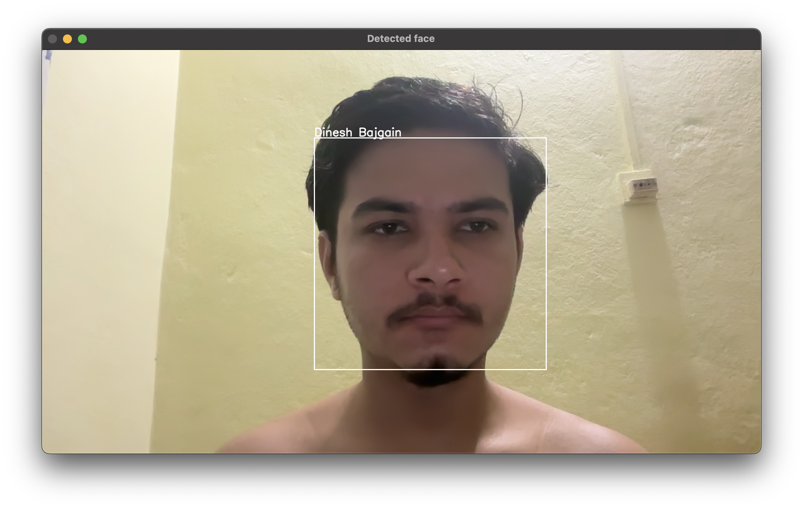

# Face Recognition System

This project is a complete face recognition system with a graphical user interface (GUI) that allows you to:

- Register users with their facial data
- Train a recognition model
- Detect and recognize faces in real-time

---

## Features

- ## **User Registration:** Capture facial data with webcam
- Database Integration: Store user information in MongoDB
- Face Detection: Using OpenCV's Haar Cascade classifier
- Face Recognition: Using LBPH (Local Binary Patterns Histograms) algorithm
- Real-time Recognition: Identify registered users through webcam feed

---

## Tech Stack

- Python
- Tkinter for GUI
- OpenCV for face detection, recognition, and image processing
- MongoDB
- Numpy
- Matplotlib

---

## Getting Started

### Prerequisites

- Python 3.6+ installed
- MongoDB installed and running locally
- Webcam

### How to Run

- Clone the repo: => git clone https://github.com/dinesh-bazgain/faceRecognizerProject.git
- cd faceRecognizerProject
- Create a virtual environment.
- pip install -r requirements.txt
- python index.py

### Usage

- Enter user details (ID, Name, Address)
- Click "Generate Data"
- Click "Training" to build the recognition model
- Click "Detect Face" to start recognition

### Known Issues

- Recognition accuracy
- UI could be improved for accessibility

### Future Improvements

- Improve UI for better user experience
- Make a real world impact

---

## License

MIT License © 2025 Dinesh Bajgain

---

## Contact

Feel free to reach out to me via [email](dinesh.bazgain@gmail.com) or open an issue on GitHub!

---

## Demo Images

  
  &nbsp;&nbsp;&nbsp;&nbsp;&nbsp;&nbsp;&nbsp;&nbsp;&nbsp;&nbsp;&nbsp;&nbsp;&nbsp;&nbsp;&nbsp;&nbsp;&nbsp;&nbsp;&nbsp;&nbsp;&nbsp;&nbsp;&nbsp;&nbsp; 
  

### Happy coding and converting!!!

---
